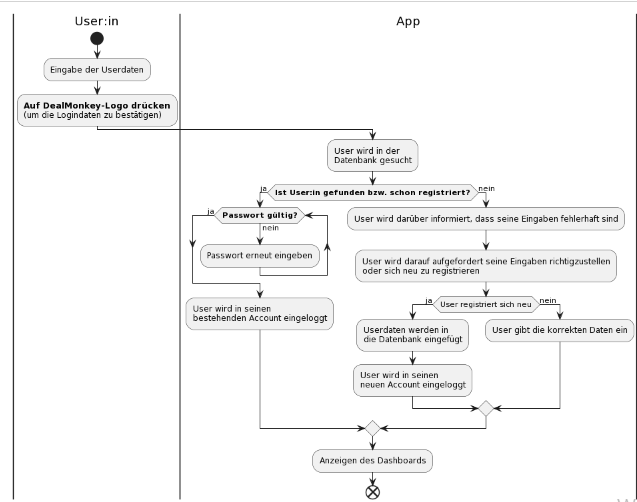

# System-Spezifikation `Deal Monkey`

## 1. Ausgangslage und Zielsetzung

DealMonkey setzt den Fokus darauf, konkreten Ziele der User in die Tat umzusetzen, wobei diese mit Deals sich selbst und ihre Freunde/Verwandten herausfordern. 

Es existieren bereits ein paar Apps, die solch ein ähnliches Ziel verfolgen - Jedoch mit viel weniger Interaktion in Hinsicht dem User und seinen/ihren FreundInnen. 

Beispielsweise trackt die App "mood!" nur deine tägliche Laune und ist sowie die App "Habit Tracker" nur auf iOS verfügbar. Durchaus sind wir der Meinung, dass diese Apps sehr leicht in "Vergessenheit" geraten, wobei wir mit Hilfe von Deals, unserem Punktesystem, Geschenken, sowie gemeinsame Nutzung mit Freunden eine mögliche leichte "Addiction" anregen wollen. Hierbei ist auch ein ansprechendes Design sehr wichtig, wobei wir uns in Hinsicht dessen gerne am Design von der App "mood!" orientieren wollen. 

_(siehe Projektantrag --> Übersicht über Vor- und Nachteile, inkl. GUI Design dieser Apps)_

### 1.1. Ist-Situation

Beispiel: Nehmen wir an Anna Musterfrau, 13 Jahre alt, möchte sich das Bücherlesen angewöhnen. Sie will täglich 15 Minuten in einem Buch lesen, ist aber zu unorganisiert bzw. faul ihrem Vorsatz nachzugehen.

### 1.2. Verbesserungspotenziale

- **Probleme**
  - Habits kaum umsetzbar ohne tägliche Erinnerungen
    - Vor allem bei StudentInnen oder SchülerInnen (wie Anna)
    - Berufstätigen Personen
  - Mangel an organisiertem Umfeld
    - Viele Apps, die alle nur eine Sache behandeln
      - Kalender, ToDo-Liste, usw...
      - Verliert Übersicht
  - Fehlende Motivation/Unterstützung
    - Es dauert 66 Tage um sich etwas anzugewöhnen
      Aus einer Studie des European Journal of Social Psychology, in der 12 Wochen lang die Gewohnheiten von 96 Personen untersucht wurden, kam folgendes hervor: Im Durchschnitt dauert es rund 2 Monate, bis eine Gewohnheit zu einer automatischen Verhaltensweise wird - genauer gesagt: 66 Tage.
      - Fazit --> Warum wir scheitern uns gewünschte Habits anzugewöhnen: Die meisten Menschen geben nach wenigen Tagen auf (aufgrund der zu schwachen Selbstdisziplin).
        Motivation und Disziplin kommt zwar von innen, kann aber von außen angeregt werden.
- **Verbesserungen**
  - übersichtlichere App-Bedienung
    - Menüs, wodurch man auf die verschiedenen Bereiche kommt (Deal, Kalender, To-Do-List, etc.)
  - Tägliche Benachrichtigungen an den Benutzer
    - Man ist mehr dahinter seine Vorsätze umzusetzen
    - Evtl. Verbesserung der Selbstdisziplin
  - Interaktion
    - Z.B.: Mit Freunden oder Familie (Steal-Deals - siehe Kapitel 2.2)
      - Folge: motivierter & mehr Spaß am aufbauen eines Habits

### 1.3. Zielsetzung

**Unser Ziel ist es eine App zu entwickeln, die User beim Antrainieren ihrer individuellen Gewohnheiten (Habits) unterstützt.**

Das Benutzen unserer App soll das Antrainieren solcher Gewohnheiten für die Benutzer leichter greifbar machen. Hierbei möchten wir vor allem die 66 Tage Angewohnzeit (siehe Studie --> 1.2) im Fokus des Konzepts der App betrachten, wobei wir trotzdem anhand App-Aktionen / bestehender Konkurrenz / Konzepte dafür sorgen möchten, dass die Benutzer motiviert bleiben - Schlussendlich wird die Motivation als ein emotionaler Prozess zur Setzung & Bewertung von Zielen (also den Habits) verstanden.

## 2. Funktionale Anforderungen
### 2.1. Use Case Überblick
#### 2.1.1. Use Case Diagramm Basics

Jeder User besitzt die folgenden Basic-Features: View all Pages, Create new Habit, Accept Deal als auch Create new Todo. Jedes dieser Features enthält verschiedene Funktionen, die gemeinsam mit den anderen zusammenspielen, sodass der Benutzer all diese Features auch verwenden muss, um folglich Deals zu erhalten und seine Gewohnheiten anzutrainieren.

### 2.2. Use Case `Create new Habit`
#### 2.2.1 GUI-Design

Jedes Habit wird vom User **täglich** ausgeführt, sodass sich der Benutzer in Folge den Habit erfolgreich antrainieren kann.

Hierbei soll ein Zeitpunkt an jedem Wochentag festgelegt werden (zum Beispiel 18 Uhr), zu dem der Benutzer vorzugsweise an den Habit, mit Hilfe von dem Use Case Deal Notification (siehe 2.4), erinnert werden möchte.

Es wird eine Übersicht namens "My Habits" (view Habits siehe 2.7) geben, wo die persönlich festgelegten Habits angezeigt werden. 

#### 2.2.2 Workflow

Auf der Seite "My Habits" gibt es ein Plus mit welchem man einen neuen Habit anlegen kann.

Der User soll bei diesem neuen Habit alle wichtigen Daten angeben, wie zum Beispiel die **Erinnerungszeiten** und die **eigentliche Tätigkeit**.

Sobald er mit dem Angeben der Daten fertig ist, wird der Habit (zu den vielleicht schon bestehenden) hinzugefügt und dieser auf der Seite "View Habits" (siehe 2.7) angezeigt. Der Benutzer muss den Habit nur noch auswählen um täglich erinnert zu werden.

### 2.3. Use Case `Create new ToDo`
#### 2.3.1 GUI-Design

Anders als bei den Habits (siehe 2.2) sind ToDos **einmalige** Vorhaben.

Hier kann man ähnlich wie bei einer ToDo-Liste eine bestimmte Aufgabe erstellen, die in einem bestimmten Zeitraum erledigt werden soll (also ein ToDo). 

Diesen Aufgaben (ToDos), kann man aufgrund ihrer Einmaligkeit auch einer Priorität zuordnen, um die Dringlichkeit der Erledigung dieser Aufgabe darzustellen. 

Auch mit Hilfe der Deal Notification (siehe 2.4) können ToDos (so wie Habits) in Form von Deals akzeptiert und abgearbeitet werden.

#### 2.3.2 Workflow

Beispielsweise kann der User sich eine neue Erinnerung erstellen. Bei der erstellten Erinnerung kann man auch eine beliebige Deadline setzen (Uhrzeit/Datum). Diese neue Erinnerung wird an den Server geschickt und gespeichert. Wenn dann der User den Task erledigt hat wird dieser am Server als erledigt gekennzeichnet.

### 2.4. Use Case `Deal Notification`
#### 2.4.1 GUI-Design

Es wird ein Deal als Benachrichtigung von userer App ausgehend an das Handy des Benutzers gesendet. Er kann diesen Deal akzeptieren (siehe 2.4.3) und seinem Vorsatz nachgehen oder ihn ignorieren bzw. ablehnen (siehe 2.4.4).

Die Benachrichtigung bzw. der Deal ergibt sich aus entweder dem täglichen Habit oder einem ToDo (hier werden dann ToDos ausgewählt, die eine höhere Priorität haben).

Sprich, wenn man also beispielsweise 3 Deal und 2 ToDos an einem Tag hat, so erhält man in Summe auch direkt 5 Deals.

#### 2.4.2 Workflow

Das System erstellt einen Deal und der User bekommt dann diesen als Benachrichtigung. Wenn der User danach den Deal akzeptiert und die Bedingung ("Check for Proof" siehe Unter Use-Case 2.4.3) erfüllt bekommt er z.B. 100 Punkte. 
Wenn der Deal nicht angeommen wird, wird dieser einfach verworfen.

#### 2.4.3. Use Case `Accept Deal-Offer`
##### 2.4.3.1. GUI-Design

##### 2.4.3.2 Workflow

Hier drückt man auf "Accept" bei der Benachrichtigung des Deals.
Wenn man einen Deal (bei der Benachrichtigung) akzeptiert, so kommt man in das Dashboard, wo der User nochmals gefragt wird, ob er/sie wirklich dazu bereit ist den Deal zu starten ("Are you ready to start the deal?"). 

Klickt man auf "Yes, I'm ready!", so startet der Deal und die Zeit rennt. 
(Es wird von der Sekunde 0 bis zu zu der angegeben Minute/Stunde raufgezählt --> weniger Stressfaktor).

##### 2.4.3. Use Case `Check for Proof`
##### 2.4.3.3 GUI-Design

Hier wird, sobald man mit der Aufgabe (also dem Habit oder dem ToDo) fertig ist, ein Beweis in Form eines Bildes bzw. Eingabe von Daten verlangt.

##### 2.4.3.4 Workflow

Der Deal wird mit einem Beweis bestätigt. Ein Beweis besteht daraus, die individuell geforderten Habit Daten anzugeben. Wenn der Beweis als gültig angesehen wird, bekommt der Benutzer die Punkte, ansonsten nicht.
Anfangs, würde der Beweis durch Daten erfolgen (z.B. wenn das Habit "10km Laufen" ist, dann tracken wir die Reichweite; oder wenn das Habit "30 Seiten Lesen" ist, so soll der Benutzer die Anfangsseite, wo er/sie begonnen hat zu lesen und die Endseite, wo er/sie aufgehört hat zu lesen, eingeben).
Später würden wir die Beweise eventuell auf eine AI verbessern.

Ein Beispiel wäre, wenn man einen Deal für 30 Minuten Lesen akzeptiert. Am Ende muss die Zeit und die Seitenanzahl die man gelesen hat eintragen.

#### 2.4.5 Use Case `Decline Deal-Offer`
##### 2.4.5.1 Workflow

Wenn man einen Deal (bei der Benachrichtigung) ablehnt, so klickt man einfach auf "Decline" und die Benachrichtigung, und somit auch der Deal, werden verworfen.

(auf das GUI-Mockup wird verzichtet)

### 2.5. Use Case `View Progress`
#### 2.5.1 GUI-Design

Der Menüpunkt "Progress" zeigt unter anderem durch Darstellung einer Barleiste an, wie viele Punkte noch bis zum nächsten Level fehlen.

Außerdem werden die Daten der User angezeigt, wie beispielsweise

- sogenannte "Flammen": Zeigen an wie viele Tage in Folge man seine To-Do's oder Habits erarbeitet, sowie die App benutzt hat. Pro Tag, an der man die App genutzt hat, erhält man eine Flamme.
- der "point-multiplier": Ab einer bestimmten Anzahl an Flammen (25 Flammen; dann wieder 50 Flammen; 75 Flammen; 100 Flammen), bekommt man dann doppelt oder dreifach so viele Punkte.

#### 2.5.2 Workflow

Der Server ruft automatisch, beim Wechseln zu diesem Menüpunkt, die Daten (welche oben zu sehen sind) ab und erfasst diese schlussendlich in der App als Prozentsatz bzw. Flammen und Balkendiagramm. 

Bsp.: Die Aktivitäts-Zeit auf der App wird vom Server abgerufen und schlussendlich mit folgenden Werten in der Statistik erfasst.

### 2.6. Use Case `View ToDo-List`
#### 2.6.1 GUI-Design

Bei dieser Seite kann man sich alle ToDos, die man zuvor angelegt hat, einschließlich ihrer Fälligkeit (und Priorität) ansehen.

#### 2.6.2 Workflow

Die für jeden Nutzer individuellen Daten bzw. ToDos werden vom Server geladen und angezeigt.

Der kleine weiße Kreis neben dem Namen des ToDos ist dafür da, dass, wenn man ein ToDo erledigt hat, es als "done" am Server kennzeichnet und es somit gelöscht wird.

### 2.7. Use Case `View Habits`
#### 2.7.1 GUI-Design

Hier sieht man alle vom Benutzer individuell erstellten Habits (und ob diese aktiviert sind oder nicht). 

#### 2.7.2 Workflow

Wenn man auf diese Ansicht wechselt, werden alle Habits, die ein Benutzer erstellt hat, geladen und angezeigt.

Der kleine Kreis neben dem Namen des Habits bestimmt, ob dieser aktiviert ist oder nicht. Also ob der Benutzer zu diesem Habit tägliche Benachrichtigungen erhalten möchte, oder nicht.

### 2.8. Use Case `View Settings`
#### 2.8.1 GUI-Design

Hier sieht man die Einstellungsoptionen, die man in unserer App "Deal Monkey" findet, sowie die bereits errichteten Einstellungen eines Users.

#### 2.8.2 Workflow

Die Einstellungsdaten werden vom Server geladen und angezeigt. 

Hier kann man auch selbst Einstellungen ändern, die dann auch am Server geändert werden, sodass "Deal Monkey" die Einstellungen bei den nächsten Besuchen der App immer noch enthält. 
(auf das Ablaufdiagramm wird hier verzichtet)

### 2.9. Use Case `View Login/Registration`
#### 2.9.1 GUI-Design

Um unsere App benutzen zu können, muss man sich zu Beginn registrieren und falls man sich abmeldet wieder einloggen. Hierfür haben wir eine eigene Login/Registration-Page, die die Userdaten erfordert.

#### 2.9.2 Workflow

Zuerst muss man die Userdaten eingeben und um diese zu bestätigen auf unser Logo drücken. Danach wird von der App analysiert bzw. untersucht, ob es einen Account mit diesen Daten gibt. 

Wenn ein Account mit diesem Usernamen existiert, wird das Passwort überprüft (und so lange eingegeben, bis es gültig ist) und der Benutzer wird angemeldet. 

Wenn kein Account existiert, wird erstmal der User darüber informiert, dass der Account möglicherweise nicht existiert, sprich er/sie also falsche Daten eingegeben hat, oder als ein neuer User sich einfach registrieren soll. 

### 2.10. Use Case `View Dashboard`
#### 2.10.1 GUI-Design

Hier sieht man die Bereiche bzw. Seiten unserer App, unter denen sich die Habits, ToDos, oder Statistiken bzw. der "Progress", usw. finden lassen.

Klickt man auf einen dieser 4 Bereiche, wechselt man automatisch zu der jeweilig verlinkten Seite bzw. Ansicht.
(auf das Ablaufdiagramm wird verzichtet)

## 3. Nicht-funktionale Anforderungen
### `Usability`: Benutzbarkeitsanforderung

- Die Software soll dem Erscheinungsbild vieler anderer Habit-Apps zusammengefügt entsprechen.
- Die Benutzeroberfläche soll übersichtlich und selbsterklärend gestaltet sein.

### `Efficiency`: Effizienzanforderung

- Die Berechnung der verschiedensten Daten darf nicht länger als 0,5 Sekunden dauern.
- Der Login- bzw. Registrierungsvorgang darf nicht länger als 5 Sekunden dauern.
- Es sollen nur die wichtigsten Daten, sprich Habits, ToDos sowie Einstellungen als auch Level gespeichert werden.

### `Security`: Sicherheitsanforderung

- Das System muss gewährleisten, dass Benutzerdaten nur vom Admin bzw. dem entsprechenden Benutzer erfasst und geändert werden können.
- Das System darf zu keinen Ausfällen kommen.
- Die Korrektheit der Daten ist entscheidend für die Ansicht der Fortschritte (siehe 2. Funktionale Anforderungen: "View Progress" 2.5) als auch für die Gewährleistung, dass sich Habits immer wieder wiederholenden.
- Alle Funktionen, die mit dem Management des Marktes in Verbindung stehen, müssen passwortgeschützt sein!

### `Legal`: Gesetzliche Anforderung

- Das Produkt muss die ISO 25010, ISO 9126 und ISO 9001 Norm erfüllen.

- (FDA) Vorschriften und Normen von internationaler Bedeutung, Food and Drug Administration
- (BDSG) Bundesdatenschutzgesetz
- (LDSG) Landesdatenschutzgesetz
- (TKG) Telekommunikationsgesetz

## 4. Mengengerüst

Zur Abschätzung der aufkommenden Datenmengen und damit verbunden der notwendigen Infrastruktur, um die nötige Performance zu erzielen, ist ein Mengengerüst zu erstellen. Mögliche Fragestellungen:

- Wieviele User werden erwartet?
- Wieviele Daten pro User werden erwartet?
- Mit welcher Anfrage-Frequenz wird gerechnet?

## 5. Systemarchitektur

### Datenmodell

- Wahlweise ER-Diagramm oder objekt-orientiertes Klassendiagramm

